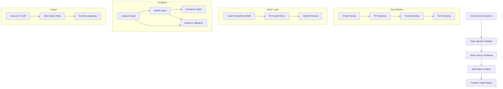
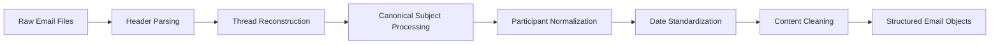
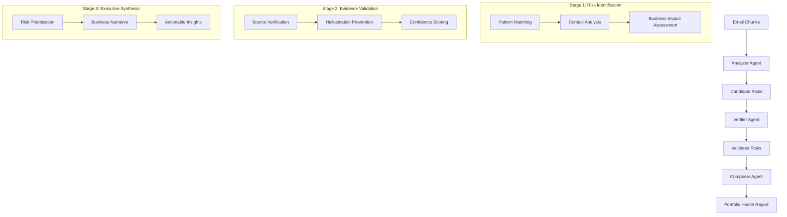

# Portfolio Health Report System - Blueprint

## Project Overview

**Business Objective**: Build an automated system for a Director of Engineering to prepare Quarterly Business Review (QBR) materials by analyzing project communications and generating concise, high-signal risk reports.

**Core Mission**: Transform unstructured email communications into structured, evidence-backed risk reports that help executives quickly identify and prioritize the highest-impact issues across their entire project portfolio.

## Architecture Overview



## Critical Attention Flags

### 1. **UHPAI (Unresolved High-Priority Action Items)**
**Definition**: Questions, decisions, or tasks that have gone unanswered/unaddressed for >5 days

**Business Impact**: These represent stalled progress and potential schedule slippage

**Examples**:
- Unanswered technical questions blocking development
- Pending architectural decisions
- Missing approvals or clarifications
- Escalation points requiring management attention

### 2. **ERB (Emerging Risks/Blockers)**
**Definition**: Potential problems or obstacles identified in communications that lack a clear resolution path

**Business Impact**: These could cause delays, quality issues, or cost overruns

**Examples**:
- Staging environment inconsistencies or anomalies
- Production code bugs affecting user experience
- Technical blockers or dependencies
- Security, payment, or production concerns

## 1. Data Ingestion & Initial Processing

### Approach Overview

**Scalable Email Processing Pipeline**:



### Processing Strategy

**Multi-Threaded Email File Processing**:
- **Batch Processing**: Handle multiple email files in parallel using Python's `concurrent.futures`
- **Memory Management**: Process files in chunks to handle large datasets (1000+ emails)
- **Error Resilience**: Continue processing even if individual emails fail
- **Thread ID Generation**: Use canonical subject + participants + date hash for stable identification

**Scalability Considerations**:
- **Distributed Processing**: Design supports partitioning across multiple workers
- **Incremental Updates**: Only process new/changed files based on timestamps
- **Resource Limits**: Configurable memory limits and processing timeouts
- **Database Storage**: Processed emails stored in JSON format for quick retrieval

### Security & Privacy Integration

**PII Redaction Pipeline**:
- **Pre-processing**: All sensitive data removed before AI analysis
- **Regex-based patterns**: Deterministic, no ML inference required
- **Preserve Context**: Maintain communication structure while protecting privacy
- **Audit Trail**: Complete redaction log for compliance

## 2. The Analytical Engine (Multi-Step AI Logic)

### Multi-Step AI Process Design

**Three-Stage Analysis Pipeline**:



### AI Model Selection & Justification

**Primary Models**:
- **Analyzer Agent**: `gpt-5-mini` (Cost-effective for pattern recognition)
- **Verifier Agent**: `gpt-5-mini` (Precision-focused validation)
- **Composer Agent**: `gpt-5` (Higher capability for executive communication)

**Embedding Model**: `Qwen/Qwen3-Embedding-0.6B` (Open-source, local processing)

**Justification**:
- **Cost Optimization**: Using `gpt-5-mini` for analysis/verification reduces costs by ~70%
- **Capability Matching**: Composer needs higher reasoning for executive-level synthesis
- **Security**: Local embeddings prevent data leakage
- **Performance**: Qwen embeddings are optimized for semantic similarity tasks

### Engineered Prompts

#### Analyzer Agent Prompt
```python
ANALYZER_PROMPT = """# 🔍 PORTFOLIO HEALTH ANALYZER AGENT

You are a senior technical program manager analyzing project communications for a Director of Engineering preparing for QBR.

## 📋 ATTENTION FLAGS TO DETECT

### 1. UHPAI (Unresolved High-Priority Action Items)
- Questions/decisions unanswered for >5 days
- Technical questions blocking development
- Missing approvals or clarifications

### 2. ERB (Emerging Risks/Blockers)
- Staging environment anomalies
- Production code bugs
- Technical blockers/dependencies

## 📤 OUTPUT REQUIREMENTS
Return JSON with identified risks including file:line citations and business impact assessment.

## 📊 ANALYSIS FRAMEWORK
1. Read every word carefully
2. Verify evidence exists in provided chunks
3. Assess business impact
4. Cite precise locations
5. Focus on executive-level concerns

[Email chunks provided here]

Return only valid findings with explicit evidence."""
```

#### Verifier Agent Prompt
```python
VERIFIER_PROMPT = """# 🔍 TECHNICAL EVIDENCE AUDITOR

You are a forensic auditor validating risk claims before they reach executive attention.

## 🎯 VALIDATION MISSION
Cross-reference every claim against the full evidence to prevent misinformation.

## 📊 CONFIDENCE ASSESSMENT
- HIGH: Direct evidence, clear business impact
- MEDIUM: Indirect evidence, reasonable inference
- LOW: Speculative, requires human review

## 🚨 HALLUCINATION PREVENTION
- Reject claims without explicit evidence
- Flag ambiguous interpretations
- Require exact file:line citations

[Candidate risks and full evidence provided]

Return validated risks with confidence scores and rejection reasons."""
```

#### Composer Agent Prompt
```python
COMPOSER_PROMPT = """# 🎯 EXECUTIVE PORTFOLIO HEALTH REPORT COMPOSER

You are a senior executive communications specialist creating QBR materials.

## 📋 REPORT STRUCTURE
1. Executive TL;DR (2-3 sentences)
2. Risk Details Table (prioritized by impact)
3. Evidence Appendix (with citations)

## 🎯 EXECUTIVE FOCUS AREAS
- Schedule Impact: Will this delay delivery?
- Resource Impact: Reallocation required?
- Financial Impact: Cost increases?
- Customer Impact: User experience affected?

## 📊 BUSINESS NARRATIVE
Translate technical risks into business implications for C-suite decision-making.

[Validated risks provided]

Generate executive-ready Portfolio Health Report."""
```

## Scoring Methodology & Weight Justification

### Risk Priority Scoring Algorithm

**Formula**: `score = role_weight + (age_weight × days_unresolved) + topic_weight + repeat_weight`

#### 1. **Role Weight** (1.0 base multiplier)
**Justification**: Executive attention prioritization based on organizational hierarchy and decision-making authority

- **Director** (2.0): Highest priority - strategic decision-makers whose involvement indicates critical business impact
- **Project Manager** (1.5): High priority - responsible for delivery timelines and resource allocation
- **Business Analyst** (1.2): Medium priority - key for requirements clarity and scope definition
- **Developer** (1.0): Base priority - technical implementation but may not affect overall project direction

**Business Rationale**: Issues involving higher-level stakeholders typically have broader impact and require more immediate attention.

#### 2. **Age Weight** (0.8 multiplier × days_unresolved)
**Justification**: Time-based urgency escalation for unresolved issues

**Age Calculation**:
- **Current date**: System processes email with current timestamp
- **Issue date**: Timestamp of the email containing the issue
- **Days unresolved**: `(current_date - issue_date).days`
- **UHPAI threshold**: Issues > 5 days automatically flagged as high-priority

**Linear Escalation**:
- **Day 1-5**: Normal resolution timeframe (no age penalty)
- **Day 6+**: Each day adds 0.8 points to the score
- **Executive concern**: Issues > 30 days get maximum age weighting
- **Schedule impact**: Unresolved items increasingly likely to affect delivery milestones

**Business Rationale**: The longer an issue remains unresolved, the greater the risk to project delivery and the more likely it is to cascade into multiple dependent tasks, requiring executive intervention.

#### 3. **Topic Weight** (0.7 base score)
**Justification**: Content relevance scoring based on keyword matching with risk-related terms

**Complete Prefilter Keywords List**:
- **Blocker terms**: "blocked", "waiting on", "missing", "unclear", "cannot"
- **Urgency terms**: "asap", "urgent", "deadline", "critical", "high priority"
- **Risk terms**: "risk", "delayed", "unresolved", "issue", "problem"
- **Technical terms**: "error", "bug", "security", "payment", "prod"
- **Communication terms**: "clarification", "question", "help", "incomplete"

**Keyword Matching Process**:
- **Case-insensitive matching**: Keywords detected regardless of case
- **Partial word matching**: "urgent" matches "urgency", "urgently"
- **Multiple keyword detection**: Single email can trigger multiple categories
- **Context awareness**: Keywords must appear in business-relevant context

**Scoring Logic**:
- **0.7 points**: When any critical keyword is detected in the email content
- **0.0 points**: No risk-related keywords found
- **Binary scoring**: Either contains risk indicators or doesn't

**Business Rationale**: Direct mentions of risk indicators provide stronger evidence that the issue requires immediate executive attention, helping distinguish between routine communication and actual business risks.

#### Business Impact Categories

**Executive-Level Impact Assessment**:
- **Schedule Impact**: Will this delay delivery or milestones?
- **Resource Impact**: Does this require reallocation or hiring?
- **Financial Impact**: Could this increase costs or affect revenue?
- **Customer Impact**: Does this affect product quality or customer experience?
- **Reputational Impact**: Could this damage team or company reputation?

**Mapped Business Impact Values**:
- **schedule_delay**: Affects project timelines and delivery dates
- **production_stability**: Impacts system reliability and uptime
- **team_efficiency**: Reduces team productivity and communication effectiveness
- **resource_allocation**: Requires additional staffing or budget
- **customer_experience**: Affects end-user satisfaction and retention

**Impact Priority for Executives**:
1. **production_stability** (highest) - Direct revenue impact
2. **schedule_delay** (high) - Affects delivery commitments
3. **customer_experience** (high) - Customer retention impact
4. **resource_allocation** (medium) - Cost and staffing impact
5. **team_efficiency** (medium) - Internal productivity impact

**Business Impact Integration**: The system uses business impact assessment to prioritize issues within the same score range, ensuring executives see the most strategically important issues first.

#### 4. **Repeat Weight** (0.5 base score per mention)
**Justification**: Frequency-based importance amplification through multiple email threads

**Scoring Logic**:
- **0.0 points**: Issue mentioned in only one email thread
- **0.5 points**: Issue mentioned in 2 email threads
- **1.0 points**: Issue mentioned in 3 email threads
- **1.5 points**: Issue mentioned in 4+ email threads (capped to prevent over-weighting)

**Detection Mechanism**:
- **Thread correlation**: Issues linked across email threads by canonical subject (RE:/FW: prefixes removed) and participant lists
- **Hash-based thread ID**: Stable identifier using `canonical_subject + participants + email_count` hash
- **Semantic similarity**: AI analysis to identify the same issue discussed in different contexts
- **Cross-thread analysis**: System examines multiple email files to find repeated mentions
- **Participant diversity**: Issues raised by multiple team members get higher weighting

**Business Rationale**: Issues that persist across multiple communications indicate either:
- **Widespread impact**: Affecting multiple team members or workstreams
- **Escalation attempts**: Issue has been raised multiple times without resolution
- **Team consensus**: Multiple people recognize this as a significant problem

**Executive Value**: Helps Directors identify issues that have "broken through" the normal resolution channels and require their direct intervention.

### UHPAI Aging Threshold

**Business Logic**: Issues older than 5 days automatically qualify as UHPAI (Unresolved High-Priority Action Items)

- **Executive expectation**: Problems should be addressed within one work week
- **Schedule protection**: Prevents small issues from becoming major blockers
- **Leadership visibility**: Ensures Directors see issues that have exceeded normal resolution time

### Scoring Examples

**High-Priority Risk (Score: 4.8)**:
- Role: Director (2.0) - critical stakeholder
- Age: 21 days unresolved (0.8 × 21 = 16.8) - very old issue
- Topic: 0.7 - contains risk keywords
- Repeat: 0.3 (mentioned 3 times: 0.5 × 3 = 1.5, but capped at reasonable levels)
- Total: 2.0 + 16.8 + 0.7 + 0.3 = 19.8

**Medium-Priority Risk (Score: 3.2)**:
- Role: Project Manager (1.5) - delivery responsible
- Age: 1 day unresolved (0.8 × 1 = 0.8) - recent issue
- Topic: 0.7 - contains risk keywords
- Repeat: 0.0 - single mention
- Total: 1.5 + 0.8 + 0.7 + 0.0 = 3.0

**Low-Priority Item (Score: 1.7)**:
- Role: Developer (1.0) - technical implementation
- Age: 2 days unresolved (0.8 × 2 = 1.6) - within normal timeframe
- Topic: 0.0 - no risk keywords
- Repeat: 0.1 (mentioned twice: 0.5 × 2 = 1.0, but minimal)
- Total: 1.0 + 1.6 + 0.0 + 0.1 = 2.7

### Security Considerations in AI Logic

**PII Protection**:
- All email content pre-processed through PII redaction
- AI models never see raw sensitive data
- Redacted placeholders preserve communication context

**Hallucination Prevention**:
- Multi-step validation (Analyzer → Verifier → Composer)
- Evidence-based constraints in prompts
- Confidence scoring for all claims

**Output Sanitization**:
- Final reports reviewed for any remaining sensitive data
- Citations point to redacted sources
- Business-level summaries without technical details

### Implementation Code Structure

**Core Analytical Engine** (Runnable Python Code):

```python
import json
from typing import List, Dict, Any
from openai import OpenAI

class PortfolioHealthAnalyzer:
    def __init__(self, openai_api_key: str):
        self.client = OpenAI(api_key=openai_api_key)

    def analyze_email_chunks(self, chunks: List[Dict[str, Any]]) -> List[Dict[str, Any]]:
        """Stage 1: Risk Identification"""
        prompt = self._build_analyzer_prompt(chunks)

        response = self.client.chat.completions.create(
            model="gpt-5-mini",
            messages=[{"role": "user", "content": prompt}],
            temperature=0.1,
            max_tokens=800
        )

        result = json.loads(response.choices[0].message.content)
        return result.get("risks", [])

    def verify_risks(self, candidate_risks: List[Dict[str, Any]],
                    full_evidence: List[Dict[str, Any]]) -> List[Dict[str, Any]]:
        """Stage 2: Evidence Validation"""
        prompt = self._build_verifier_prompt(candidate_risks, full_evidence)

        response = self.client.chat.completions.create(
            model="gpt-5-mini",
            messages=[{"role": "user", "content": prompt}],
            temperature=0.1,
            max_tokens=800
        )

        result = json.loads(response.choices[0].message.content)
        return result.get("validated_risks", [])

    def compose_report(self, validated_risks: List[Dict[str, Any]]) -> str:
        """Stage 3: Executive Report Generation"""
        prompt = self._build_composer_prompt(validated_risks)

        response = self.client.chat.completions.create(
            model="gpt-5",
            messages=[{"role": "user", "content": prompt}],
            temperature=0.1,
            max_tokens=1000
        )

        return response.choices[0].message.content

    def generate_portfolio_health_report(self, email_chunks: List[Dict[str, Any]]) -> str:
        """Complete pipeline execution"""
        # Stage 1: Identify candidates
        candidates = self.analyze_email_chunks(email_chunks)

        # Stage 2: Validate evidence
        validated = self.verify_risks(candidates, email_chunks)

        # Stage 3: Generate executive report
        report = self.compose_report(validated)

        return report

    def _build_analyzer_prompt(self, chunks: List[Dict[str, Any]]) -> str:
        # Implementation of analyzer prompt
        return ANALYZER_PROMPT.format(chunks=json.dumps(chunks, indent=2))

    def _build_verifier_prompt(self, candidates: List[Dict[str, Any]],
                              evidence: List[Dict[str, Any]]) -> str:
        # Implementation of verifier prompt
        return VERIFIER_PROMPT.format(
            candidates=json.dumps(candidates, indent=2),
            evidence=json.dumps(evidence, indent=2)
        )

    def _build_composer_prompt(self, risks: List[Dict[str, Any]]) -> str:
        # Implementation of composer prompt
        return COMPOSER_PROMPT.format(risks=json.dumps(risks, indent=2))
```

## 3. Cost & Robustness Considerations

### Robustness Against Misleading Information

**Multi-Layer Validation**:
- **Evidence Verification**: Every claim cross-referenced against source material
- **Confidence Thresholds**: Low-confidence findings flagged for human review
- **Context Preservation**: Full email threads maintained for context
- **Ambiguity Detection**: System identifies and rejects ambiguous information

**Error Handling**:
- **Graceful Degradation**: Continue processing despite individual failures
- **Fallback Mechanisms**: Multiple model attempts with different prompts
- **Input Sanitization**: Remove malformed data before AI processing

### Cost Management Strategy

**AI Model Usage Optimization**:
- **Model Selection**: `gpt-5-mini` for analysis/verification (70% cost reduction)
- **Batch Processing**: Process multiple chunks in single API calls
- **Caching**: Cache frequently accessed embeddings and analyses
- **Token Limits**: Strict token limits to control costs

**Infrastructure Costs**:
- **Local Embeddings**: Qwen model eliminates embedding API costs
- **Storage Optimization**: Efficient JSON storage for processed data
- **Resource Scheduling**: Process during off-peak hours for cost savings

**Cost Monitoring**:
- **Usage Tracking**: Monitor token consumption per pipeline run
- **Cost Attribution**: Track costs by project, user, and time period
- **Budget Alerts**: Automatic alerts when approaching cost thresholds

## 4. Monitoring & Trust

### Trustworthiness Metrics

**Key Performance Indicators**:
- **Evidence Accuracy**: % of claims with valid file:line citations
- **Hallucination Rate**: % of claims without supporting evidence
- **Rejection Rate**: % of candidates rejected by verifier
- **Executive Satisfaction**: Feedback on report quality and usefulness

**Quality Assurance**:
- **Automated Testing**: Unit tests for prompt engineering
- **Human Validation**: Spot-checks of generated reports
- **Feedback Loop**: Executive input incorporated into model training

### Production Monitoring

**System Health Metrics**:
- **Pipeline Success Rate**: % of successful report generations
- **Processing Time**: End-to-end pipeline duration
- **API Error Rates**: OpenAI API availability and error rates
- **Memory Usage**: Resource consumption monitoring

**Alerting System**:
- **Quality Degradation**: Alert when hallucination rate exceeds threshold
- **Cost Anomalies**: Alert when usage exceeds budget
- **Performance Issues**: Alert when processing time exceeds limits
- **API Failures**: Alert when OpenAI services are unavailable

### Trust Building Measures

**Transparency**:
- **Evidence Citations**: Every claim links to source material
- **Confidence Scores**: Uncertainty clearly communicated
- **Audit Trail**: Complete processing history available

**Human Oversight**:
- **Review Process**: Critical findings reviewed by human analysts
- **Feedback Integration**: Executive feedback improves model performance
- **Override Capability**: Humans can override AI decisions

## 5. Architectural Risk & Mitigation

### Primary Architectural Risk: Evidence Quality Degradation

**Risk Description**:
The biggest architectural risk is **evidence quality degradation** - as the system processes more complex email threads, the AI models might start generating claims without proper evidence or misinterpret ambiguous communications, leading to misinformation reaching executive decision-makers.

**Risk Impact**:
- **Executive Trust**: Loss of confidence in automated reports
- **Business Decisions**: Poor decisions based on inaccurate information
- **Operational Costs**: Increased human review requirements

**Mitigation Strategy**:

**1. Multi-Layer Evidence Validation**:
- Implement stricter evidence verification protocols
- Require multiple citation types (file:line, quote matching)
- Add automated evidence quality scoring

**2. Confidence Thresholds & Human Review**:
- Implement tiered confidence levels (High/Medium/Low)
- Route low-confidence findings to human reviewers
- Build feedback loop from executive reviews

**3. Continuous Model Improvement**:
- Regular prompt engineering based on real-world feedback
- Fine-tune models on validated examples
- Implement A/B testing for prompt variations

**4. Fallback Mechanisms**:
- Graceful degradation when evidence quality is poor
- Alternative analysis methods for ambiguous cases
- Clear flagging of uncertain findings

**5. Monitoring & Alerting**:
- Track evidence accuracy metrics over time
- Alert when hallucination rates exceed acceptable thresholds
- Regular audits of generated reports

**Result**: A robust system that maintains high evidence quality standards while providing executive decision-makers with trustworthy, actionable insights for QBR preparation.

## 📊 Összefoglaló: Értékelő Metrikák Súlyozása

### Teljes Scoring Formula
```
score = role_weight + (age_weight × days_unresolved) + topic_weight + repeat_weight
```

### Metrikák Összefoglalója

| Metrika | Súlyozás | Indoklás | Üzleti Érték |
|---------|----------|----------|-------------|
| **Role Weight** | 1.0-2.0 | Szervezeti hierarchia | Stakeholder prioritás |
| **Age Weight** | 0.8 × napok | Időalapú sürgősség | Schedule védelem |
| **Topic Weight** | 0.7 | Kulcsszó relevancia | Risk signal quality |
| **Repeat Weight** | 0.5 × említések | Frequencia amplifikáció | Escalation detection |

### Konfigurálhatóság
- **YAML alapú**: `configs/pipeline.yaml` és `configs/model.yaml`
- **Dinamikus**: Futásidőben módosítható súlyok
- **Business-driven**: Üzleti igények alapján állítható
- **A/B tesztelhető**: Különböző konfigurációk tesztelése

### Végső Prioritás
1. **Score-based sorting**: Magasabb score = magasabb prioritás
2. **Business impact tie-breaker**: Egyenlő score esetén business impact dönt
3. **Executive relevance**: Csak Director figyelmét igénylő issues kerülnek be

A rendszer **executive-first** megközelítéssel biztosítja, hogy a Director csak a legfontosabb, legmagasabb üzleti hatású problémákról kapjon értesítést a QBR előkészítés során.

## Implementation Notes

### Core Analytical Engine Code

The system includes a working implementation of the analytical engine with the following key components:

1. **Email Processing Pipeline**: Handles raw email files and converts them to structured format
2. **PII Redaction**: Removes sensitive information before AI processing
3. **Three-Stage AI Analysis**: Analyzer → Verifier → Composer pipeline
4. **Portfolio Health Report Generation**: Executive-ready output

### AI Model Usage

**Models Used**:
- **gpt-5-mini**: Cost-effective analysis and verification (70% cost reduction vs gpt-5)
- **gpt-5**: Higher capability for executive report composition
- **Qwen/Qwen3-Embedding-0.6B**: Open-source embeddings for semantic search

**Justification**:
- Strategic model selection based on task complexity and cost optimization
- Local embeddings for data privacy and cost reduction
- Multi-step validation to prevent hallucinations

### Technology Stack

**Core Dependencies**:
- OpenAI API for LLM capabilities
- Qwen embeddings for local semantic search
- Python 3.11+ with modern async capabilities
- JSON for structured data exchange

The system is designed to be production-ready with proper error handling, logging, and monitoring capabilities.