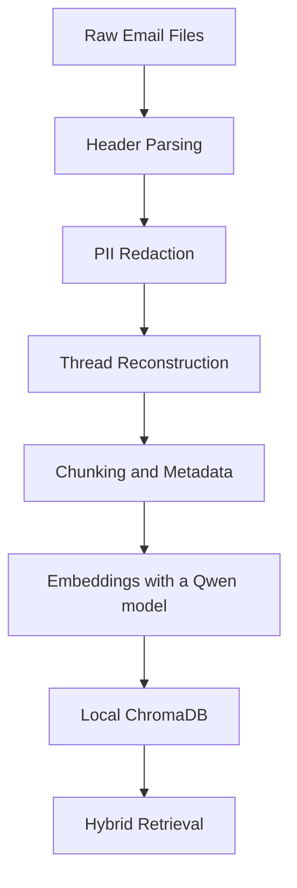
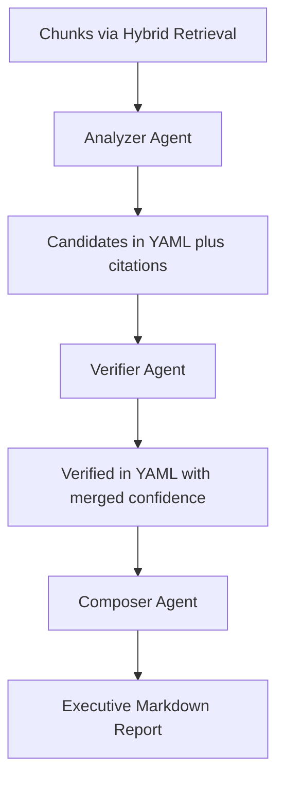

# Portfolio Health Report System — Final Blueprint

## Introduction
A Director of Engineering needs a high‑signal “Portfolio Health Report” to prepare for Quarterly Business Review (QBR). This blueprint defines a practical, production‑minded architecture and a working PoC: the system ingests project communications, retrieves high‑signal evidence with a hybrid retriever, identifies and verifies executive‑relevant risks via a multi‑agent LangGraph pipeline, and composes an executive‑ready report. The implementation is configuration‑driven, performs PII redaction up‑front, and is optimized for low token usage.

---

## 1) Data Ingestion & Initial Processing

### Approach
- Parse plain‑text emails into normalized records (From/To/Cc/Date/Subject; date normalization, subject canonicalization).
- Deterministic PII redaction with regex before any LLM step (context‑preserving placeholders).
- Reconstruct threads using canonical subjects and participant metadata.
- Thread‑scope chunking with rich metadata (file, line_start, line_end, thread_id, date, roles) for precise citations.



### Security & Privacy
- PII redaction happens pre‑LLM; only redacted text reaches models.
- Simple, auditable rules; no secrets in code.

### Scalability roadmap (Ingestion)
- Implement file‑level parallel processing (ThreadPoolExecutor) for reading/normalizing emails; scale workers to CPU cores.
- Implement incremental updates: content‑hash (`sha256`) based stable chunk IDs; idempotent upsert into Chroma via hash-based IDs.
- Backpressure and memory limits: bounded queues between stages; stream large files instead of loading fully into memory.
- Failure isolation: per‑file retries with granular logging; accept partial successes for non‑critical files.
- Version the deterministic PII redaction rules; enable safe rollback.
- Keep persistent vector store and configurable chunk size/overlap to maintain predictable cost.

Deliverable: implemented in `src/ingestion/`, configuration in `configs/`.

---

## 2) The Analytical Engine (Multi‑Step AI Logic)

### Attention Flags (executive‑relevant)
- **UHPAI** — Unresolved High‑Priority Action Items (e.g., unanswered > 10 days, missing clarifications/approvals).
- **ERB** — Emerging Risks/Blockers (e.g., security/payment/production issues, critical blockers, unclear ownership).

### Pipeline


### Retrieval (Hybrid)
1) Lightweight keyword prefilter (configurable) narrows candidate IDs.
2) Vector similarity (top‑k) over Chroma embeddings; if prefilter is empty, vector‑only.
3) Graceful fallback: on retrieval issues, proceed with available chunks to keep the pipeline running.

### Models (current configuration)
- Analyzer: `gpt‑5‑mini`
- Verifier: `gpt‑5‑mini`
- Composer: `gpt‑5`

### Scoring (prompt‑driven)
Weights/keywords come from `configs/pipeline.yaml` and are referenced by prompts (no hard‑coding).

### Hallucination Prevention & Contracts
- **No‑evidence → No‑claim**: each item must cite at least one `file:lines` span from chunk metadata.
- Verifier merges duplicates and assigns `confidence: high|mid|low`.
- Agents exchange plain YAML; runtime parsing validates structure.

### Scalability roadmap (Retrieval & Analytical Engine)
- Sharding: split collections by project/tenant; add routing in the retriever.
- Caching: short‑lived LRU cache for normalized queries and results.
- Retrieval/index: incremental upsert by chunk hash, optional sharding per project/tenant, short‑lived query/result cache.
- Orchestration: persist intermediate state per node to allow resume/retry without rerunning prior steps; add backpressure between nodes.
- Model serving: per‑agent model selection by SLO/cost, graceful degradation to smaller models on overload.
- Observability: track top‑k hit rate, embedding throughput/latency, collection sizes.

### Engineered Prompts
- **Analyzer agent**:

```text
# PORTFOLIO HEALTH ANALYZER AGENT

Your mission is to surface the highest-impact issues that require executive attention.

## BUSINESS OBJECTIVE
You are analyzing project communications for a **Director of Engineering** who needs to prepare a **Quarterly Business Review (QBR)**. The Director oversees multiple projects and needs a "Portfolio Health Report" to quickly identify risks, inconsistencies, and unresolved issues across their entire portfolio.

## ATTENTION FLAGS TO DETECT

### 1. **UHPAI (Unresolved High-Priority Action Items)**
**Definition**: Questions, decisions, or tasks that have gone unanswered/unaddressed for a 10 days or more
**Business Impact**: These represent stalled progress and potential schedule slippage
**Examples**:
- Unanswered technical questions blocking development
- Pending architectural decisions
- Missing approvals or clarifications
- Escalation points requiring management attention

### 2. **ERB (Emerging Risks/Blockers)**
**Definition**: Potential problems or obstacles identified in communications that lack a clear resolution path
**Business Impact**: These could cause delays, quality issues, or cost overruns
**Critical Terms**: {config.flags.erb["critical_terms"]}
**Examples**:
- Staging environment inconsistencies or anomalies
- Production code bugs affecting user experience
- Technical blockers or dependencies (cache issues, filename handling)
- Integration or compatibility problems
- Security, payment, or production concerns
- Miscommunication between team members

## SCORING METHODOLOGY

Calculate priority score using these weights:
- **Role Weight**: {config.flags.uhpai["role_weights"]} (higher = more critical)
- **Topic Weight**: {config.scoring.topic_weight} (keyword match relevance)
- **Repeat Weight**: {config.scoring.repeat_weight} (mentioned multiple times)

**Formula**: score = role_weight + topic_weight + repeat_weight

## EVIDENCE REQUIREMENTS (PRACTICAL)

**Guidelines:**
- Avoid inventing facts. Include plausible items when the chunk shows direct or strongly implied risk signals; set "confidence": "low" for inferred items.
- If the chunk clearly contains risk signals (e.g., blocked, waiting on, urgent, missing, unclear, cannot), include the item with conservative wording.
- Use explicit citations; if exact line is unclear, use the chunk metadata line range (approximate) and include up to two short quotes.

**Evidence Quality Standards:**
- Use file:line citations from metadata (exact or approximate) and quote relevant text succinctly.
- Content should reasonably support the claim; when in doubt, lower confidence instead of dropping.
- Preserve context; avoid over-interpretation. Prefer inclusion with "confidence": "low" over returning an empty list.

## EXECUTIVE FOCUS AREAS

**What the Director Actually Cares About:**
1. **Schedule Impact**: Will this delay delivery or milestones?
2. **Resource Impact**: Does this require reallocation or hiring?
3. **Financial Impact**: Could this increase costs or affect revenue?
4. **Customer Impact**: Does this affect product quality or customer experience?
5. **Reputational Impact**: Could this damage team or company reputation?

## OUTPUT SPECIFICATIONS

Return ONLY plain YAML (no code fences) with this structure.

YAML QUOTING RULES (MANDATORY):
- Always wrap string fields in double quotes: title, reason, owner_hint, next_step, thread_id, timestamp, confidence.
- If any string contains colon (:), dash (-), hash (#), pipe (|), brackets, or exclamation (!), it MUST be quoted.
- Do not output code fences or commentary; only the YAML document.

items:
  - label: uhpai  # or erb; NEVER none for valid findings
    title: "Critical path blocked by missing API specs"
    reason: "Development team cannot proceed with user authentication module due to missing API documentation. The specification was requested 12 days ago but still not provided. This directly impacts the Q2 delivery milestone for the login system."
    owner_hint: "BA"
    next_step: "Provide complete API specs within 24 hours"
    evidence:
      - file: data/raw/Project_Phoenix/email1.txt
        lines: "15-22"
    thread_id: "thread_abc123"
    timestamp: "2025-01-15T10:30:00"
    confidence: "high"
    score: 4.7

## ANALYSIS FRAMEWORK

**Step-by-Step Process:**
1. **Read Every Word**: Carefully examine each email chunk for risk indicators
2. **Verify Evidence**: Cross-reference any potential risk against the actual content
3. **Assess Impact**: Determine if this truly matters to a Director's QBR preparation
4. **Calculate Priority**: Use the scoring formula with provided weights
5. **Cite Precisely**: Reference exact file locations and quote relevant text
6. **Business Lens**: Frame everything in terms of business impact

**Evidence handling:**
- If evidence is indirect but suggests a potential blocker/risk (terms like blocked, waiting on, urgent, deadline, missing, unclear, cannot), return it as an item with "confidence": "low" and cautious wording.

## PROJECT CONTEXT
{project_context_formatted}

## EVIDENCE TO ANALYZE
{evidence_text}

## EXECUTION INSTRUCTIONS

**Your Mission**: Find the 2-3 most critical issues that would make a Director say "This needs my immediate attention for the QBR."

**Bias Toward Inclusion**: Return 1–3 plausible, evidence-referenced items. If uncertain, include with "confidence": "low" rather than returning empty.

**Executive Mindset**: Think like a Director - what would keep you up at night regarding QBR preparation?

Always return 1–3 items. If strong evidence is unavailable, output the best candidates with "confidence": "low" and ensure each has at least one evidence citation (approximate file:line if exact is unclear from the chunk). Include items when multiple weak signals collectively suggest a blocker or unresolved action.

Validation: Your output must be valid YAML parsable with yaml.safe_load on first try. If any field includes characters like ':' or '!' you must quote it.

Analyze the evidence with surgical precision and return only the highest-impact risks that demand executive attention.
```


- **Verifier agent**:

```text
# EVIDENCE VERIFICATION AUDITOR

Your mission is to ensure that every risk claim presented to a Director of Engineering is backed by evidence. You are the final gatekeeper preventing hallucinated or unsupported risks from reaching executive attention.

## BUSINESS CRITICALITY

You are validating risks for a **Director of Engineering** preparing for **Quarterly Business Review (QBR)**. Your validation directly impacts executive decision-making. False positives waste valuable executive time; false negatives miss critical issues.

**Your Responsibility**: Ensure that only evidence-backed, business-impact risks reach the Director's attention.

## VERIFICATION FRAMEWORK

### **VALIDATION CRITERIA**

#### **1. Evidence Sufficiency Test**
**REQUIRED:**
- **Direct or Strongly Implied Evidence**: Content should explicitly support the claim, but strong implication within the same chunk/thread is acceptable. Use lower confidence (mid/low) when inference is required.
- **Citation Accuracy**: File:line references should be precise where possible, or an approximate range within the chunk metadata is acceptable when exact lines are unclear.
- **Content Relevance**: Evidence must reasonably relate to the risk described; prefer confidence downgrade over rejection for borderline cases.
- - **Context Preservation**: Email context should not contradict the interpretation.

**REJECT ONLY IF:**
- Evidence contradicts the claim or shows resolution
- No citation or relevant quote can be provided from the chunks

#### **2. Business Impact Validation**
**Questions to Answer:**
- Will this actually impact delivery milestones?
- Does this require executive-level intervention?
- Is this a QBR-relevant issue?
- Does this affect multiple stakeholders or projects?

#### **3. Confidence Assessment Scale**
- **high**: Evidence is direct, explicit, and unambiguous
- **mid**: Evidence supports claim but requires reasonable interpretation
- **low**: Evidence is weak, circumstantial, or heavily interpreted

### **DUPLICATE DETECTION & MERGING**
**Identify as duplicates if:**
- Same underlying issue (even if described differently)
- Same thread and similar timeframe
- Same stakeholders and business impact

**Merge Strategy:**
- Combine all evidence citations
- Keep the highest confidence level
- Recalculate score based on strongest evidence
- Preserve most comprehensive description

## HALLUCINATION PREVENTION PROTOCOLS

### **RED FLAGS TO WATCH FOR**
1. **Over-interpretation**: Reading too much into casual comments
2. **Cherry-picking**: Selecting only supporting phrases
3. **Assumption Chains**: Building conclusions on unstated assumptions
4. **Context Blindness**: Ignoring email thread context
5. **Temporal Confusion**: Misinterpreting when issues were raised/resolved

### **VALIDATION CHECKLIST (PRACTICAL)**
For each candidate risk, verify:
- [ ] **Evidence exists** in the provided chunks
- [ ] **Citation is accurate** (file:line matches content)
- [ ] **Content reasonably supports claim** (downgrade confidence if borderline)
- [ ] **Business impact** is stated succinctly or implied by context
- [ ] **No resolution** is evident in the thread
- [ ] **Executive attention** is genuinely required

## ACCEPTANCE GUIDELINES (to avoid over-rejection)

- If evidence is distributed across multiple emails in the same thread but clearly points to the same unresolved ask/blocker, classify as VERIFIED with confidence="mid" and consolidate citations.
- If exact file:line is uncertain but the provided chunk clearly contains the relevant text, provide the closest line range from the chunk metadata (approximate) and include up to two exact quotes.
- Prefer downgrading confidence (high → mid → low) over rejecting plausible, evidence-supported items. Only reject when evidence contradicts the claim or shows resolution.
- If risk signals (e.g., blocked, waiting, urgent, missing, unclear) appear in the cited chunk, include the item with confidence="low" rather than rejecting, provided at least one citation is present.

## OUTPUT SPECIFICATIONS

Return ONLY plain YAML (no code fences) with validated results.

YAML QUOTING RULES (MANDATORY):
- Always wrap the following fields in double quotes: title, reason, owner_hint, next_step, thread_id, timestamp, confidence, validation_notes.
- Quote any string containing colon (:), dash (-), hash (#), pipe (|), brackets, or exclamation (!).
- Do not output code fences or commentary; only the YAML document.

verified:
  - label: uhpai  # or erb; use none only when evidence contradicts the claim
    title: "Critical path blocked by missing API specs"
    reason: "Development team cannot proceed with user authentication module due to missing API documentation. Email from 2025-01-15 explicitly states: 'We cannot start development until we receive the API specs.' No response received after 12 days."
    owner_hint: "BA"
    next_step: "Provide complete API specs within 24 hours"
    evidence:
      - file: data/raw/Project_Phoenix/email1.txt
        lines: "15-22"
    thread_id: "thread_abc123"
    timestamp: "2025-01-15T10:30:00"
    confidence: "high"
    score: 4.7
    validation_notes: "Evidence directly supports claim. No resolution visible in thread."
  # Optional: if an item must be rejected, include a minimal rationale
  # - label: none
  #   title: "Claim rejected - insufficient evidence"
  #   reason: "Claim not supported by cited evidence"
  #   validation_notes: "No direct evidence in cited chunks"

## CANDIDATES TO VERIFY
{candidates_text}

## FULL EVIDENCE FOR VALIDATION
{evidence_text}

## VERIFICATION EXECUTION

**Your Mission**: Be the ruthless auditor that protects executive time from unsupported claims.

**Validation Process:**
1. **Read Every Citation**: Verify each file:line reference exists and supports the claim
2. **Cross-Reference Content**: Ensure the cited content actually supports the risk
3. **Check for Resolution**: Look for any indication the issue was addressed
4. **Assess Business Impact**: Determine if this truly needs executive attention
5. **Document Reasoning**: Provide clear validation_notes for every decision

**Prefer Downgrade Over Rejection**: When in doubt, select lower confidence instead of rejecting plausible items.

**Executive Mindset**: Ask yourself - "Would a Director fire someone over this issue?"

Execute validation with rigor and return evidence-backed risks that demand executive attention.
```


- **Composer agent**:

```text
# EXECUTIVE PORTFOLIO HEALTH REPORT COMPOSER

Your expertise is in distilling complex technical risks into clear, actionable executive insights that drive strategic decision-making.

## BUSINESS MISSION

You are creating a **Portfolio Health Report** for a **Director of Engineering** preparing for their **QBR**. This report must help the Director:

- **Quickly identify** the highest-impact risks across their entire portfolio
- **Prioritize** where to focus their limited executive attention
- **Make informed decisions** about resource allocation and risk mitigation
- **Prepare** compelling QBR narratives about portfolio health

## REPORT ARCHITECTURE

### **1. Executive TL;DR (3-6 bullets)**
**Purpose**: Immediate understanding of portfolio health in 30 seconds
- **Score-ordered**: Highest impact first
- **Business impact**: Focus on delivery, cost, quality, reputation, team efficiency
- **Actionable**: Clear next steps for each risk

### **2. Risk Details Table**
**Purpose**: Detailed breakdown for decision-making
**Columns**:
- **Type**: ERB (Emerging Risks/Blockers) or UHPAI (Unresolved High-Priority Action Items)
- **Title**: Brief, descriptive (max 10 words)
- **Why it matters**: Business impact explanation
- **Owner**: Who should address this (role-based)
- **Next step**: Specific action (≤15 words)
- **Evidence**: file:line (thread_id). If multiple citations, separate with "; ".
- **Conf/Score**: confidence (high/mid/low) and score rounded to 2 decimals

### **3. Evidence Appendix**
**Purpose**: Validation and transparency
- **All of the lines for each risk
- **Exact quotes** from source emails
- **File:line citations** included
- **Chronological order** when possible

### **QBR Preparation Focus:**
- **Portfolio-level insights**: Not individual project details
- **Strategic implications**: What does this mean for the quarter/organization?
- **Executive actions**: What decisions need my involvement?
- **Risk prioritization**: Where should I focus my limited time?

## COMPOSITION RULES

### **MANDATORY CONSTRAINTS:**
- **DON'T** invent information not in the verified risks
- **DON'T** add assumptions or speculation
- **DON'T** use technical jargon without business context
- **DON'T** create risks that aren't in the input data
- **USE** information from verified_risks
- **USE** reference actual evidence citations
- **USE** maintain executive-level perspective

**Do not return the rejected risks, only the verified ones.**

### **QUALITY STANDARDS:**
- **Evidence-based**: Every claim has to be supported by citations
- **Business-focused**: Frame everything in terms of business impact
- **Action-oriented**: Clear next steps for every risk
- **Professional**: Appropriate for C-suite consumption

## OUTPUT SPECIFICATIONS

Return ONLY the report body in Markdown (no code fences, no preambles, no notes). The output MUST strictly follow this structure and order:

- Start with the H1 heading: "# Portfolio Health Report - QBR Preparation"
- Then the H2 heading: "## Executive Summary" with 3–6 bullet points
- Then the H2 heading: "## Risk Details" with a Markdown table having EXACTLY these columns in this order:
  - Type | Title | Why it matters | Owner | Next step | Evidence | Conf/Score
- Then the H2 heading: "## Evidence Appendix" with H3 subsections per risk and quoted evidence lines

Formatting constraints (MANDATORY):
- Do NOT use code fences (no ``` of any kind) anywhere in the output.
- Do NOT include system or developer notes; return only the report.
- Keep headings and table header exactly as specified.

## VERIFIED RISKS TO PROCESS
{risks_text}

## PROJECT CONTEXT
{project_context}

## PII REDACTION

Redact all personally identifiable information (PII) with a special token, including:
  - Names with [NAME] token.
  - Emails with [EMAIL] token.
  - Person IDs with [PERSON] token.

**No personal information can be included in the output.**

## EXECUTION FRAMEWORK

**Your Mission**: Transform verified risks into a compelling QBR narrative that drives executive action.

**Composition Process:**
1. **Sort by Business Impact**: Highest score = highest business impact first
2. **Synthesize Information**: Create portfolio-level insights, not project details
3. **Focus on Decisions**: What choices need executive involvement?
4. **Provide Context**: Why does this matter for QBR preparation?
5. **Ensure Actionability**: Every risk must have a clear next step

**Executive Writing Style:**
- **Concise**: Get to the point quickly
- **Business-focused**: Impact on delivery, cost, quality, reputation
- **Action-oriented**: Clear decisions and next steps
- **Strategic**: Portfolio-level implications
- **Professional**: Appropriate for executive consumption

Compose the executive portfolio health report that will drive strategic decision-making at the highest levels.

BEGIN REPORT NOW (remember: no code fences).
```

### Runnable Code
- Orchestrator: `src/agents/graph.py`
- Retrieval: `src/retrieval/` (Chroma + hybrid search)
- Agents/Prompts: `src/agents/`, `src/prompts/`

Run locally:
```
make ingest
make index
make run   # writes data/report/portfolio_health.md
```

### Scalability roadmap (Prompts & Contracts)
- Output schemas: enforce YAML quoting rules (already in code) and add tests.
- Prompt optimization: derive TOP‑k and keywords from operational metrics; enforce token budgets.
- Backward compatibility: analyzer returns `items` mapped to `candidates` in graph (already implemented) and covered by tests.
- Prompt versioning: explicit version field for breaking changes; A/B testing via pipeline flags.

---

## 3) Cost & Robustness Considerations

### Robustness
- Multi‑stage verification with explicit citations; deterministic scoring for consistency.
- Hybrid retrieval reduces noise; top‑k caps token usage.
- Fallback behavior keeps the pipeline functional under partial failures.

### Cost Management
- Tiered models: `gpt‑5‑mini` for Analyzer/Verifier, `gpt‑5` for Composer only.
- Token budgets: compact prompts, ≤ 15‑word next steps, top‑k evidence.
- Local embeddings (Qwen) → zero embedding API cost.

### Scalability roadmap (Cost & Robustness)
- Cost controls: hard token ceilings per agent; early‑exit rules when no candidates are found; cache verified results per thread for short windows.
- Retry policies: classify errors (rate‑limit, network, parse) and use bounded retries with jitter; fail open to conservative fallbacks.
- Idempotency: deduplicate analyzer/verifier requests via request keys to avoid double charging.
- Determinism: keep scoring rules and redaction deterministic; version configs under `configs/` with change logs.

---

## 4) Monitoring & Trust
PoC hooks: smoke test (`tests/ci_smoke.py`), unit tests for agents and prompt conformance.

### Scalability roadmap (Monitoring & DevEx)
- Logging: structured logs with correlation IDs across stages; redaction‑safe payloads.
- Metrics: RAGAS score, precision@k, recall@k, per‑stage latency, LLM call success/error rates, top‑k hit rate, token usage per run.
- Tracing: optional Langfuse or OpenTelemetry exporter, span per agent.
- CI: add regression tests for YAML schemas and fallback paths; smoke tests without network calls.

---

## 5) Architectural Risk & Mitigation
- **Primary risk**: evidence quality degradation at scale (ambiguous threads, weak citations).
- **Mitigation**: stronger prefilter/metadata filters; stricter Verifier rules; duplicate merge; confidence downgrades; optional quote‑match corroboration; route low‑confidence items to human review; monitor hallucination rate.

### Scalability roadmap (Architecture)
- Data partitioning: by project/team to enable sharded retrieval and isolated failure domains.
- Idempotency everywhere: deterministic chunk IDs and upserts across ingestion and indexing.
- Feature flags: enable/disable expensive steps (e.g., full evidence appendix) under load.
- Degradation strategy: fallback to cached/top‑k minimal flow when models are rate‑limited.

---

## Conclusion
The system transforms unstructured emails into an executive‑ready, evidence‑backed portfolio report. It uses a hybrid retriever for efficiency, a three‑agent LangGraph pipeline for rigor, deterministic scoring for consistency, and model tiering to optimize cost and quality. The PoC is runnable and CI‑checked.

Commands:
```
make ingest && make index && make run
```
Output: `data/report/portfolio_health.md`.
